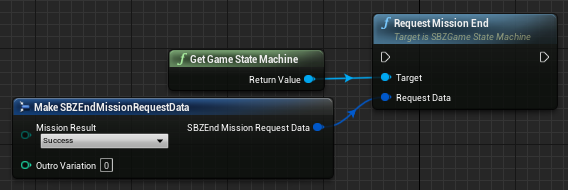

# PAYDAY 2 > PAYDAY 3 Cheatsheet/Differences

| PAYDAY 2         | PAYDAY 3   | Notes                                                                                                   |
|:-----------------|:-----------|:--------------------------------------------------------------------------------------------------------|
| Continents       | Levels     | See [UE4's docs for more details](https://docs.unrealengine.com/4.27/en-US/Basics/Levels/LevelsWindow/) |
| Mission Elements | Blueprints | Replaced by blueprints, see [MissionElements](#mission-elements) for exceptions                         |
| Units            | Actors     |                                                                                                         |

## Mission Elements
| PAYDAY 2             | PAYDAY 3                                                       | Notes                                                                          |
|:---------------------|:---------------------------------------------------------------|:-------------------------------------------------------------------------------|
| AreaTrigger          | SBZPlayerTriggerVolume                                         |                                                                                |
| DifficultyLevelCheck |         | Equivalent to this blueprint code                                              |
| LootBag              | SBZBagSpawner                                                  |                                                                                |
| MissionEnd           |  | Equivalent to this blueprint code                                              |
| Objective            | SBZObjective                                                   | See [Objectives](/custom-heists/objectives)                                    |
| PlayerSpawner        | PlayerStart + SBZPlayerStartGroup                              | Use as actors in level                                                         |
| Timer                | Delay                                                          | Function in blueprint                                                          |
| UnitSequenceTrigger  | Events in blueprint code                                       |                                                                                |
| Waypoint             | SBZWaypoint                                                    | See [Waypoints](/custom-heists/objectives#adding-waypoints-to-your-objectives) |
