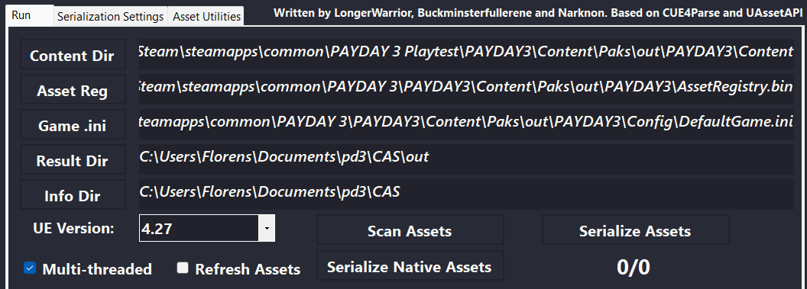

# Asset Toolkit
Some assets such as meshes and textures cannot be added to the unofficial modding toolkit<!-- TODO: add link when available -->,
because they contain Starbreeze's intellectual property.
If you wish to use these assets in your mod, you can generate and add them to the toolkit yourself.

The pipeline for generating 

## Generating the project
<!-- guide on generating headers and uproject -->
:::note Work in progress
This part of the guide is incomplete.
If you're using the template project as a base for asset generation, you can continue below.
:::

## Dumping Game Assets 
First, we need to extract all of the game's archives.
These are located under `{GAME_DIRECTORY}\PAYDAY3\Content\Paks`.
It is recommended to use [repak](https://github.com/trumank/repak),
you can download it and add it to your PATH or place it in the Paks directory.

```shell
cd C:\Program Files (x86)\Steam\steamapps\common\PAYDAY 3 Playtest\PAYDAY3\Content\Paks
for %f in (*.pak) do @(repak.exe --aes-key 0xABCDEF12345789 unpack --force "%f" out)
```

The AES encryption key is not shared publicly at this time,
as we have not received explicit permission from Starbreeze to do so.
However, you should be able to source it yourself quite easily by googling around.

## Serializing to JSON
Next, we need to serialize the extracted assets to the JSON format understood by the AssetGenerator plugin.
To do this, we need a tool called [UEAssetToolkitGenerator](https://github.com/LongerWarrior/UEAssetToolkitGenerator),
also known as CAS or CookedAssetSerializer.

:::info
Additional information on this tool can be found on the [UEAssetToolkitGenerator Wiki](https://github.com/LongerWarrior/UEAssetToolkitGenerator/wiki).
:::



In the **Run** tab of the program, you need to set five paths:
1. **Content Dir:** in the extracted `.pak` files at `PAYDAY3\Content`
2. **Asset Reg:** in the extracted `.pak` files at `PAYDAY3\AssetRegistry.bin`
3. **Game .ini:** in the extracted `.pak` files at `PAYDAY3\Config\DefaultGame.ini`
4. **Result Dir:** the directory to write the serialized files to, make sure this is empty
5. **Info Dir:** the directory to output asset scan results and logs files to

Then, before starting the serialization process,
make sure to set the right Engine Version (4.27 at the time of writing)
and enable **Multi-threaded**.

:::caution
Running serialization with multi-threading is experimental but speeds up the process 10x.
If you want to be extra sure there are no faults in the output,
you can simply run the serialization process more than once with **Refresh Assets** disabled.
:::

In the panel on the right, make sure you have everything checked.
This ensures you have all the assets you want, plus all the assets those assets reference.
If you only want to add a small selection of assets to your editor project,
then you can filter this in the next section.


Finally, run these in order:
1. Scan Assets
2. Serialize Native Assets
3. Serialize Assets, this might take a while depending on your system specs

## Generating Editor Assets
:::info
Additional information on this tool can be found on the [UEAssetToolkit Wiki](https://github.com/LongerWarrior/UEAssetToolkitGenerator/wiki).
:::

### Installing the Asset Generator editor plugin
Download [UEAssetToolkit](https://github.com/Buckminsterfullerene02/UEAssetToolkit-Fixes)
by cloning it or downloading it as a zip file.
Then move the `AssetGenerator` and `AssetDumper` directories to your project's `Plugins` directory.
If your editor is already open, you will have to restart to compile and load the plugin.

### Generating Assets
Go to `Windows -> Developer Tools -> Asset Generator`.

#### Textures
To import textures into the editor, you will want to use the command line.
Running the Asset Generator from the editor for these two asset types is too unstable.

```shell
UE4Editor-Cmd.exe "C:\path\to\project\PAYDAY3.uproject" -run=AssetGenerator -DumpDirectory="C:\Users\YourUser\Documents\AssetToolkit\CASOutput" -AssetClassWhitelist="Texture2D" -NoRefresh -abslog "C:\path\to\log\gen_log.txt" -stdout -unattended -NoLogTimes
```

Additionally, even from the command line, it might take a couple of attempts.
Due to memory leaks, importing textures can crash many times.
If you encounter this issue, you can manually increase the Windows page size.

After the command has run to completion, it is recommended to start the Unreal Editor
to check if everything is in the right place and to let shaders compile.

#### Models and Animations
You can either generate dummy meshes and animations,
or follow the instructions on the [Models and Animations](models) page
to generate fully functional assets.
