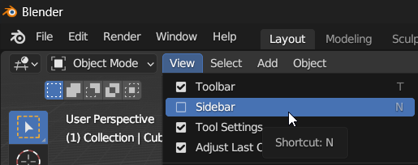
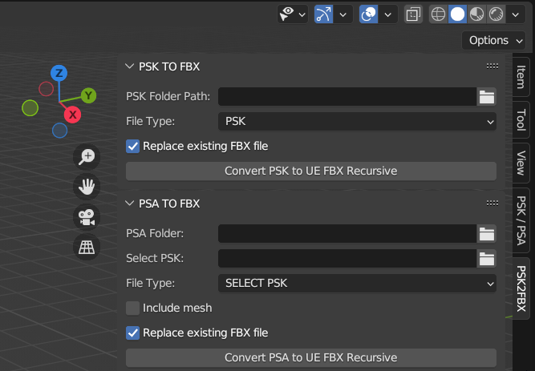

# Models and Animations

Generating Unreal Editor assets for Models and Animations is an advanced process of many steps, tools, and scripts.
This is only intended for advanced users who intend to use the Game's models and animations in their own mods,
to create new heists, for example.

Developers who wish to create new assets using the Game's models or replace the Game's models
can follow the guide on [Using/Replacing Game Assets](#)<!-- TODO: link -->.


:::info
This guide is based on the [Generating FBX](https://github.com/LongerWarrior/UEAssetToolkitGenerator/wiki/Generating-FBX) guide on the UnrealAssetToolkit wiki.
If you get stuck or need help, please check there first for the most up-to-date information.
:::

:::danger
You cannot legally distribute the assets obtained by following this guide.
:::

:::note
This guide assumes you have already created an [Unreal Editor project](#).
:::

## Extracting ActorX files
ActorX is the format Unreal Engine uses internally to represent meshes and animations.
These are files with the `.psk`, `.pskx` and `.psa` extensions.
To obtain these files and their metadata, we will use a fork of CUE4Parse specially created for this task.

```shell
git clone https://github.com/Buckminsterfullerene02/CUE4Parse.git --recursive
cd CUE4Parse
git checkout mass-export
```

Next, open the solution in your tool of choice, Visual Studio (not Code) or Rider are recommended.
Open `Program.cs` under the `AnimExport` project.

```csharp title="AnimExport/Program.cs"
public class Progam
{
    // SET THESE FOR YOUR GAME
    // highlight-start
    private const string _pakDir = @"C:\Program Files (x86)\Steam\steamapps\common\PAYDAY 3\PAYDAY3\Content\Paks";
    private const string _aesKey = ""; // If your game does not have an AES key, leave this empty
    // highlight-end
    private const string _mapping = ""; // If your game does not need a mappings file, leave this empty
    // highlight-next-line
    private const EGame  _version = EGame.GAME_UE4_27; // Check if your game has a custom version, as some do
    private const bool   _exportMaterials = false; // This needs to be false if generating for CAS+UEAT
    private const bool   _useInternalName = true; // Sometimes package path is not set properly meaning paths are not synced, so if it isn't, set to true
    // highlight-next-line
    private const string _outputDir = @"C:\Users\YourUser\Documents\AssetToolkit\AnimExport";
    private const bool   _replaceFiles = false;
    private const bool   _printSuccess = true; // Once you've verified this works, set this to false to reduce console spam
    private const bool   _hasStrippedAssetRegistry = false; 
    private static readonly List<string> _folderNames = new() { "Anims", "Anims", "Anims", "SKMs", "SMs", "SKs" };
    
    // DO NOT TOUCH ANYTHING BELOW THIS LINE
    
    // ...
}
```
1. Set `_pakDir` to the path to your game's `Paks` directory.
2. Set `_aesKey` to the game's PAK AES encryption key, you should be able to source this pretty easily.
3. Set `_version` to the Unreal Engine version the game is using.
   As of writing this article, the Unreal Engine version is **4.27**.
4. Set `_outputDir` to the directory where you want to output the ActorX and JSON files.
   This directory should be empty.
5. Leave all other fields set to their default values as shown above.

Finally, run the `Main` method of the AnimExport project. This will create the following in your output directory:
- Anims: Animation Sequences, Montages and Compositions
- SKMs: Skeletal Meshes
- SMs: Static Meshes
- SKs: Skeletons

## Converting to FBX
In this part, we will use Blender and some custom plugins to import the ActorX files and export them in FBX format.
If you don't already have Blender installed, you can download the latest version from the [Blender downloads page](https://www.blender.org/download/).

With Blender installed, we will need to add two plugins from GitHub:
1. [blender3d_import_psk_psa](https://github.com/matyalatte/blender3d_import_psk_psa): download the repository as zip
2. [psk_psa_batch_export.py](https://github.com/KaiserM21/HelperScripts/tree/main): download just the python file

Place these under `%AppData%\Roaming\Blender Foundation\Blender\3.6\scripts\addons`.
You might need to open Blender first for it to create this path. You can add any missing directories yourself.

You may need to fix these two imports in `psk_psa_batch_export.py` manually:
```python title="psk_psa_batch_export.py"
# ...

import re
import os
import json
import bpy
from bpy.types import Scene
from bpy.props import (BoolProperty,
                        StringProperty,
                        EnumProperty,
                        PointerProperty )
# highlight-start
from io_import_scene_unreal_psa_psk_280.io_import_scene_unreal_psa_psk_280 import pskimport
from io_import_scene_unreal_psa_psk_280.io_import_scene_unreal_psa_psk_280 import psaimport
# highlight-end
```

With the addons in place, we will need to enable them from the Blender interface.
Go to `Edit -> Preferences -> Addons`,
and enable the `Import: ActorX to FBX for Unreal` and `Import-Export: Import Unreal Skeleton Mesh (.psk)/Animation Set (.psa) (280)` addons.

Before you do the next steps, navigate to `Window -> Toggle system console`.
This will help give you an indicator of what it's currently doing,
as the main blender window will completely freeze when running the mass export.

Next, open the sidebar by going toggling `View -> Sidebar`, or by simply pressing `N`.



From the sidebar, select the `PSK2FBX` tab.



1. Run `Convert PSK to UE FBX Recursive` with
   - the file type `PSK`
   - the PSK Folder Path set to `SKMs`
2. Run `Convert PSK to UE FBX Recursive` with
   - the file type `PSKX`
   - the PSK Folder Path set to `SMs`
3. Run `Convert PSA to UE FBX Recursive` with
   - the file type `USE FOLDER`
   - the PSA Folder `Anims`
   - the Skeleton Folder set to `SKs/Blender`

## Moving the FBX
Now we need to copy **only** the FBX files to the directory UEAssetToolkitGenerator will output serialized assets to.
To do this correctly, you can use the [copy_fbx_to_cas.py](https://gist.github.com/florensie/eff2c6e5e3ae7b238832343bf8a2a091) Python script.

```shell
cd C:\Users\YourUser\Documents\AssetToolkit
python copy_fbx_to_cas.py .\AnimExport .\CASOutput --internalname PAYDAY3 --types Anims,SMs,SKMs
```

The first argument is the directory containing the `Anims`, `SMs` and `SKMs` subdirectories.
The second argument is the `Result Dir` you have set in CAS.

## Serializing for import

Open the UEAssetToolkitGenerator, and check your settings:
- AnimSequence, AnimMontage, SkeletalMesh, Skeleton and StaticMesh should **not** be selected under `Asset Types to Skip Serializing`
- All checkboxes under `Use ActorX?` should be disabled
- `Force mesh JSON to have one LOD?` should be enabled

Scan the assets and run the serializer.
If this is your first time using Cooked Asset Serializer,
refer back to the instructions on the main [Asset Toolkit](..) documentation page.

## Importing into the editor
<!-- TODO: guide to downloading and adding AssetGenerator plugin to project -->

:::tip Source Control
If you publish the sources of your project as a git repository, you will want to exclude the generated assets.
An easy way to do this is to first [git stash](https://git-scm.com/docs/git-stash) any pending changes you currently have.
Then after generating the assets you can simply add everything under `Content` to your `.gitignore` file.
:::

### Materials
:::note
If you have not yet [generated texture assets](..#textures) in your project, now would be the time to do so.
:::

To import materials into the editor, you can likewise use the command line.
This one should take less time than generating textures and require less memory.

```shell
UE4Editor-Cmd.exe "C:\path\to\project\PAYDAY3.uproject" -run=AssetGenerator -DumpDirectory="C:\Users\YourUser\Documents\AssetToolkit\CASOutput" -AssetClassWhitelist="Material" -NoRefresh -abslog "C:\path\to\log\gen_log.txt" -stdout -unattended -NoLogTimes
```

### Static Meshes
In your editor, navigate to `Window -> Developer Tools -> Asset Generator`.
Generating static meshes suffers from video memory leaks, . 

### Skeletal Meshes
<!-- TODO -->

### Animations
<!-- TODO -->
