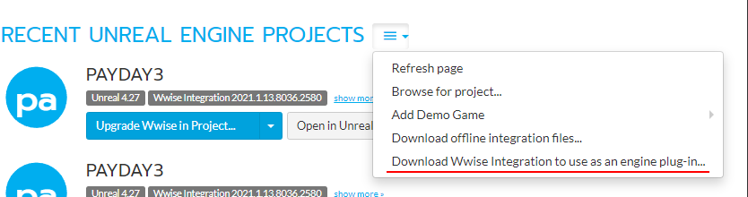
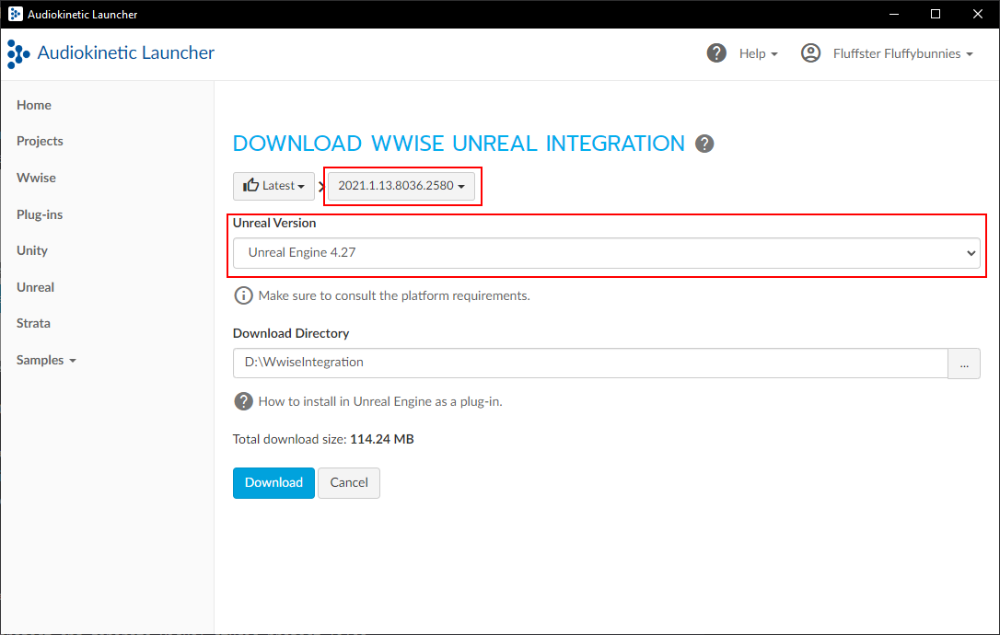
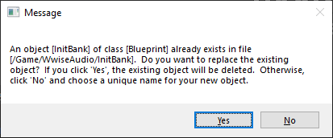
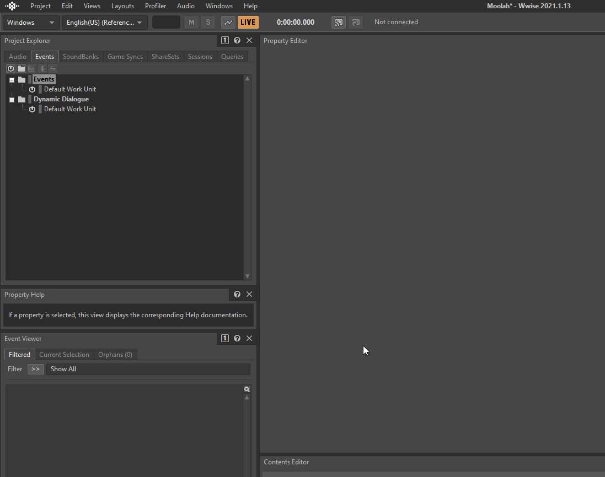
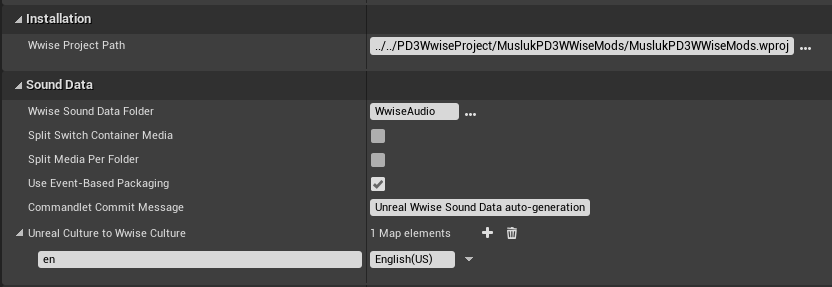
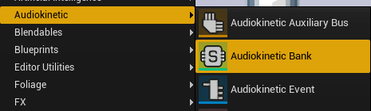
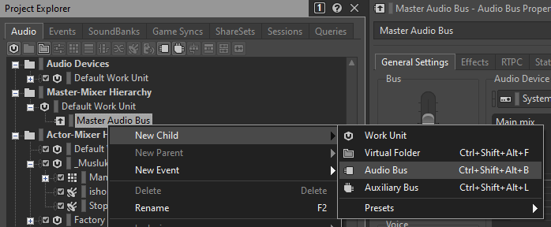
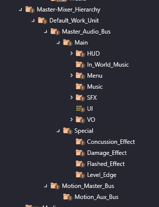

# Integrating Wwise into Unreal Engine

With a proper Wwise integration, you can add new sounds, do some editing like random pitch shifting without editing every sound file or even randomize the sounds played, make new tracks, tie the sound levels to the in game sliders, and make the sound work on both Steam/Epic platforms and Gamepass version.

## The Integration Process

:::caution Make sure you have time and drive space set for this
This will take some time and about 10-12 gigabytes of free space. You'll be building the unreal engine and downloading 2 SDKs. Depending on your computer and net speed, it can take a bit.
:::

### Prerequisites

- [Audiokinetic Wwise launcher](https://www.audiokinetic.com/en/download/)
- [A fresh copy of Moolah Project Template](https://github.com/MoolahModding/MoolahProject)
- [Visual Studio. Any version between 2017-2022.](https://visualstudio.microsoft.com/downloads/)

Check [the Unreal Engine documentation](https://docs.unrealengine.com/5.0/en-US/setting-up-visual-studio-development-environment-for-cplusplus-projects-in-unreal-engine/#optionsforanewvisualstudioinstallation) for which submodules you need to build UE.

### File Preparation

First things first, grab a fresh copy of MoolahProject template and extract it. Check the notes at the end for a Legal Warning for uploading BP mods.
Go to your new empty Moolah Template folder, go to `MoolahProject-main\Plugins\EnginePlugins\Wwise\Source\AkAudio\Public\` and grab `ESBZAkPoolType.h` and copy it somewhere safe for now.
Delete the entire Wwise folder in `Plugins\EnginePlugins\`.

Open the Wwise launcher, install the SDK for windows on the version 2021.1.13.8036 - you will have to modify your current install.
Once that finishes, go to the Unreal tab in the Wwise launcher, click the hamburger menu and go for "Download Wwise integration to use as an engine plugin"

:::note
Default install version is different, don't forget to change the Wwise version from 2022 to 2021.1.13.8036 and Unreal engine version to 4.27.
:::

Once the download is done, go to the folder you downloaded into, grab the entire Wwise folder and paste it under `MoolahProject-main\Plugins\Wwise`.

In that `MoolahProject-main\Plugins\Wwise` folder, make a new folder called `ThirdParty`.

Go to the SDK from Wwise installation, by default in `C:\Program Files (x86)\Audiokinetic\Wwise 2021.1.13.8036\SDK`
Copy the following folders from the `C:\Program Files (x86)\Audiokinetic\Wwise 2021.1.13.8036\SDK` folder to the `MoolahProject-main\Plugins\Wwise\ThirdParty` folder:

        include
        x64_*

You'll be copying a total of 5 folders.

Get the `ESBZAkPoolType.h` you copied earlier and place it in `MoolahProject-main\Plugins\Wwise\Source\AkAudio\Public`

### Rebuilding Unreal Editor

Right-click the PAYDAY3 .uproject and click Generate Visual Studio project files.
Once that's done, open the PAYDAY3.sln with Visual Studio and hit build.

### Finally, getting Wwise and Unreal Editor to integrate

After building is done, launch the uproject. While loading, it might prompt you to replace the existing initbank:

Say no to this prompt.

After UE fully launches and you're looking at the empty map, UE will ask if you want to change the WWise settings. Say no to this prompt as well.

Tab back to Wwise, launch 2021.1.13.8036 version. In the Project Launcher, make a new project. Select a location preferably outside your UE folder. Open up the project, go to Project>Project Settings>Source Settings and change the default conversion settings to PCM Autodetect high.

Save your project afterwards.

Shut down Unreal Editor, go to `MoolahProject-main\Content\Wwise\` and delete everything inside.

Relaunch Unreal Editor. Go to project settings, scroll all the way down to Wwise section and click Integration Settings.

Set Wwise sound data folder to `WwiseAudio` and set the Wwise Project to wherever you set your project back in the actual Wwise program.

Ignore the restart prompt if UE asks for it. Go back to Project Settings > Wwise > integration, untick "Use Event-Based Packaging". It might throw you some errors, just click OK through everything.

Click User Settings below the Integration Settings and tick `Auto Connect to WAAPI`. Go back to Integration Settings and double check if the WwiseAudio folder is still there. If not, enter it again. Re-tick `Use Event-Based Packaging`. Say OK to Unreal Editor asking you to delete the InitBank.
Restart Unreal Editor. After the restart, Wwise audio folder will get populated with a bunch of subfolders. Head back into Project Settings > Wwise > User Settings, check if the "Auto Connect to WAAPI" got unticked. If it did, tick it again. Then tick "Enable Automatic Asset Synchronization".

In your Wwise project, create a new event, check if it populates inside Unreal Editor. If it does, you've integrated it successfully.
Don't forget to generate soundbanks in WAAPI/Wwise picker.

## Basic Project Flow 
### First Steps
For adding a custom sound, it goes something like this:
1. Open Wwise.
2. Import audio file under Actor-Mixer Hierarchy.
3. Set up an event to use the audio. If you want to replace an existing event's audio, name it exactly as it appears in Fmodel.
4. Go to the sound banks tab and create a sound bank.
5. Hit F7 for sound bank view
6. Drag the created event from the bottom left into the soundbank.
7. Click Generate All, then save your project.

Once in Unreal Editor, create an AKBank with the EXACT same name as the sound bank in Wwise.

:::caution If the file names don't match, you won't get the audiobanks inside Unreal Editor.
:::

1. Find the Event created earlier under `WwiseAudio\Events\<EventStructure>`.
1. Double click the event and set it to use the modded soundbank.
1. In the WAAPI picker (Window>WAAPI Picker), hit Generate Sound Data.
1. Right click your event and hit play event - if done correctly, it should play inside the editor.
1. If you connected Wwise to Unreal Editor via localhost inside the Wwise program with Profiler > Show Remote Connections, it should update all your directories and create a Media folder with your .wem file in `MoolahProject-main\Content\WwiseAudio`.
1. Use the event as you normally would use an AKEvent within the Unreal Editor.

### Using Main Buses to tie Custom sounds to In Game Audio levels
You can place dummy Audio Buses in Wwise to tie your audio's volume to in game sliders.

Currently, game uses these Buses, taken from Fmodel:

Replicate them in Wwise and you're good to go.

### Sharing your BP mods with custom audio source code

:::note Due to legal reasons, do NOT share the WWise Plugin folder
:::

Make sure git ignores `<Project>\Content\Plugins\Wwise`.

Your sounds events will be playable by others if you include the WwiseAudio\Events and WwiseAudio\Media folders along with your Soundbank with no issues.
