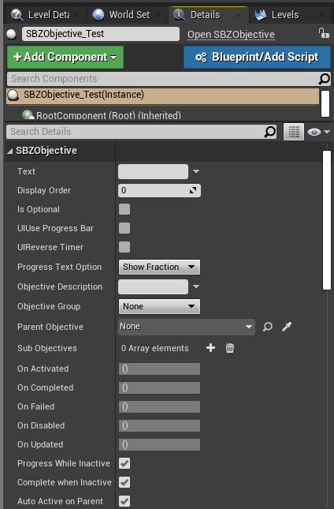
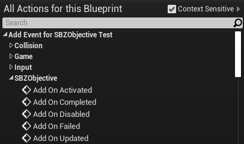
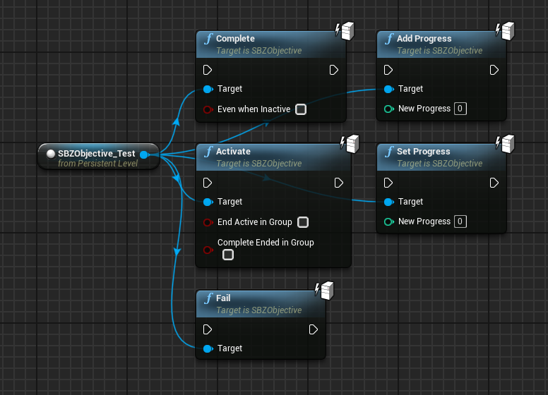
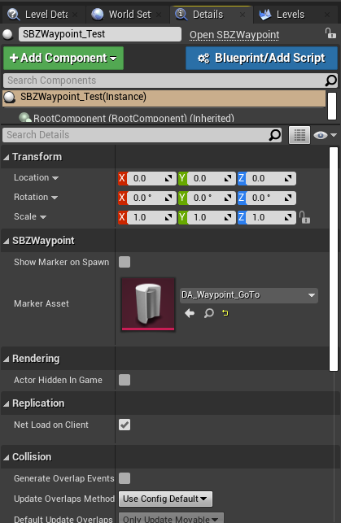
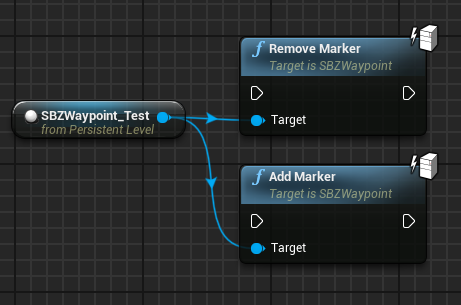
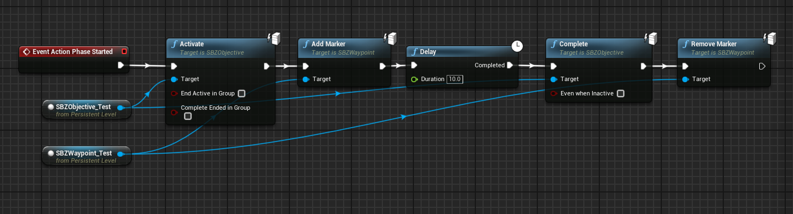

# Objectives

## Creating objectives

To make an objective, you must make one `SBZObjective` actor for every objective you want.
You can create a `SBZObjective` actor by finding it in the `Place Actors` window and placing one in your map.

Once placed you will need to set a name, you can set its name with the `Text` property in the details panel.
Now is also a good time to set the description, whether it is optional and set its progress.
A description is not required, but it appears in the Tab menu.

## Adding logic to your objectives

First, open your level blueprint if you have not already. You can do this by opening the `Blueprints` option in the toolbar and clicking `Open Level Blueprint`.

Once open, make sure your objective is selected in the World Outliner and right-click in the Blueprint Editor and create a reference for it.
Now you can call functions on your objective.
If you wish to receive events like `On Activated` and `On Completed`,
with your objective selected open the `Add Event` menu, open `SBZObjective` and add the events you want to listen for.

### Activating an objective

Using your objective reference, you are able to call the function `SBZObjective::Activate`.
This will trigger the `On Activated` event on your objective and also make it visible to the player.

### Failing an objective

Similar to [activating an objective](#activating-an-objective), you can call `SBZObjective::Fail` to fail an objective.
This will trigger the `On Failed` event on your objective and also fail it.

### Completing an objective

To complete an objective, call the `SBZObjective::Complete` function in your level blueprint.
It is best to activate any following objectives after this.

### Adding progress

If you're objective needs a progress indicator, such as securing bags, you can increment it using the `SBZObjective::AddProgress` function.

### SBZObjective functions

## Adding waypoints to your objectives

To add a waypoint, simply add a `SBZWaypoint` actor to your map in the location you want the waypoint to appear.
You must also set the `Marker Asset` property to the marker you want to use, for this example I used `DA_Waypoint_GoTo`

### Activating a waypoint

To activate a waypoint, call the `SBZWaypoint::AddMarker` function.

### Removing a waypoint

To remove a waypoint, call the `SBZWaypoint::RemoveMarker` function.

### SBZWaypoint functions

## Example

### Explanation

This blueprint code will activate an objective and waypoint when the heist starts.
It will then wait 10 seconds, complete the objective and remove the marker.
