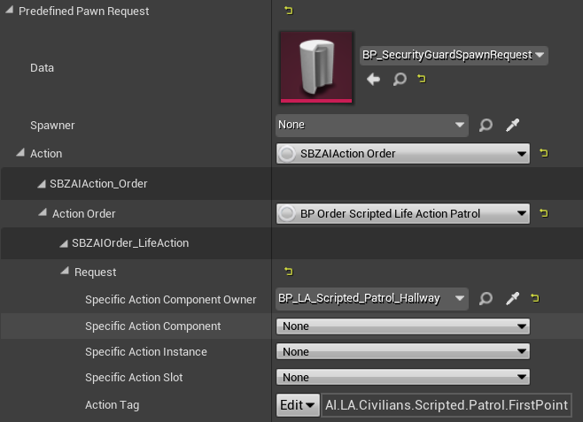
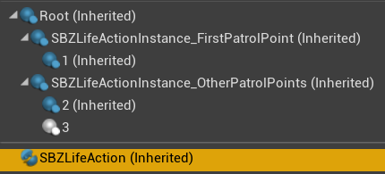

# Patrols
Patrols are used by guards in stealth, and civilians to walk between fixed points and perform certain animations.

To start with creating a patrol, make sure you have your pawn spawn set up.
You can do so with a `SBZPawnSpawnPredefined`.

Next, add a BP_LA_Scripted_Patrol to your scene (the positioning does not matter).
You can then link this blueprint actor to your pawn spawn like this:

Now you can edit the patrol points and their life actions on the scripted patrol actor.
By default, the scripted patrol has two `LifeActionSlots`.
You can add more, and they should be named in incremental numbers.

LifeActionSlots have a bunch of properties you can tweak. Most important are:
- **Tag:** the animation the character will play (waiting, smoking, scrolling on phone) 
  Pick any under `AI.LA.Civilians.*`.
- **Duration:** you can either set a fixed duration or a random duration in a range 
  This defines how long the character will spend in the LifeAction
- **Cooldown:** unknown
- **Acceptable radius/angle:** recommended to enable this,
  it should allow characters to start the life action early when they can’t quite reach the exact point/angle specified

## Escort Points
When you get caught in a private area, a guard should escort you to the nearest escort point.
Simply place a `SBZEscortPoint` at the exits to your public area.
