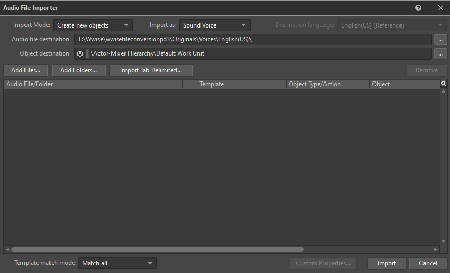

# Audio editing

## Prerequisites
:::note
You do not require Unreal Engine Editor to be installed to replace the game's audio, and this tutorial does not require Unreal Engine Editor to be installed.
:::
 - [Wwise](https://www.audiokinetic.com/en/products/wwise) 2021.1.13.8036 **or** [wwise_pd3](https://github.com/MoolahModding/wwise_pd3/releases/latest)
 - A program that can extract UE4 PAK files, for example: [FModel](https://fmodel.app), [UModel](https://github.com/gildor2/UEViewer)
 - A program that can pack UE4 PAK files, for example: [repak](https://github.com/trumank/repak), UnrealPak
 - [Bence's Uexp Utility](https://github.com/bence0585/Bences-uexp-utility) or a hex editor such as [HxD](https://mh-nexus.de/en/hxd), to edit the uexp to have the right size

## Setting up your sound files
In order for Wwise and wwise_pd3 to work properly, your files must be
in the WAV format with PCM encoding. The best way to do this is to use
a tool like ffmpeg to encode your audio to little endian 16-bit.

An example command for this is `ffmpeg -i input.wav/mp3 -c:a pcm_s16le output.wav`

## Encoding your files for PAYDAY 3

### Using Wwise
1. Make sure you have a Wwise project made for converting all
your audio files.

:::warning
Your Wwise project must have its Conversion Settings set to `PCM Auto Detect High`
before you import any files. Or they will not play in PAYDAY 3.

You can set this by opening the project settings (Project->Project Settings),
going to the Source Settings tab. Pressing the 3 dots next to the
currently set conversion setting and selecting
`Factory Conversion Settings -> PCM -> PCM Auto Detect High`
:::

2. Import your audio files using the "Import Audio Files..." option in the project menu or
use Shift+I when in the project.

3. Once you open the audio importer, you will need add your files using
the "Add Files..." button.

4. Once you've selected your files, press the "Import" button and wait
for it to finish importing.
5. Once complete, save your Wwise project and press the "Convert All Audio Files...".
6. Once the Audio File Conversion window is open, press the "Convert"
button at the bottom of the window.
7. Once the audio files have finished converting, the WEM files will be
in `{WwiseProjectFolder}/.cache/Windows/SFX`. Once you've located them,
you can continue to the [Adding your converted files to PAYDAY 3](#adding-your-converted-files-to-payday-3)
section of this guide

### Using wwise_pd3
:::note
At the moment, voice line encoding is supported, voice line decoding is not.
:::

1. Open a command prompt window in the folder your
WAV files are in.
2. Use the command `wwise_pd3 -encode input.wav output.wem`
3. Your WEM file will be located where you specified the output file to go
4. You can now continue to the [Adding your converted files to PAYDAY 3](#adding-your-converted-files-to-payday-3)
section of this guide

## Adding your converted files to PAYDAY 3
Once you have your encoded Wwise file, you will first
need to find the file you are trying to replace
in PAYDAY 3's game files.

If you are struggling to find the one you want to replace,
you can use the [map of Names to Ids](#wwise-ids-currently-used-by-the-games-soundtrack).

Once you've found the one you want to replace, open your preferred
PAK explorer, like FModel, and navigate to `PAYDAY3/Content/WwiseAudio/Media`.
Once there, search for the file id you want to replace and extract it.

Once extracted, you will need 3 files: `{Id}.uasset`, `{Id}.ubulk` and `{Id}.uexp`,
copy these files to your mod's `PAYDAY3/Content/WwiseAudio/Media` folder.

Before deleting or modifying any files,
please note the `Size` value of the ubulk file in the Windows properties window,
particularly the size in bytes as you will need it later

Now, you can delete the ubulk from the game and rename your wem file to have the same name,
including the extension.

### Editing the uexp

:::info
If you do not wish to edit the uexp yourself,
you can use [Bence's Uexp Utility](https://github.com/bence0585/Bences-uexp-utility)
:::

If you package it like this, it will play for a moment in the game,
but will quickly turn to loud static.
To fix this issue, open the uexp you extracted earlier in a hex editor software,
then open the properties window of the ubulk file you originally extracted.
Take the size (in bytes) of the ubulk, and convert it to hex here: https://www.save-editor.com/tools/wse_hex.html

Make sure to have Little Endian box ticked.
Copy the converted hex and search for it in the hex editor with CTRL+F.
You should find this hex string twice in the hex editor.
(For example: "8C 6C 85 01 8C 6C 85 01" mean 25,521,292 bytes; "40 5C C1 00 40 5C C1 00" mean 12,672,064 bytes)
Now open the properties of your new ubulk which was the wem file you made.
Convert that file size (in bytes) to hex as well.
Finally, replace those 2 instances of the old file's size in hex with the new hex converted size you obtained.
Make sure to save your uexp file in the hex editor before closing.

Once done, save and repackage your mod, and you'll find your audio replacement plays properly.

## List of Wwise IDs for the soundtrack
### No Rest For The Wicked / BranchBank
| Name                                                                    | Wwise Id   | Notes                                                              |
|:------------------------------------------------------------------------|:-----------|:-------------------------------------------------------------------|
| BranchBank_Anticipation_Intro_130bpm_16bars_v02                         | 856428028  | 1st half 0.000s-20.000s                                            |
| BranchBank_Anticipation_Intro_130bpm_16bars                             | 653308651  | 2nd half 25.538s-29.538s                                           |
| BranchBank_Anticipation_Loop_130bpm_2bars                               | 382346082  |                                                                    |
| BranchBank_Assault_Intro_130bpm_2bars                                   | 48507945   |                                                                    |
| BranchBank_Assault_Loop_v02                                             | 629662482  | Sequence 0.0s-0.1s-59.170s, 1m58.260s-3m11.850s, 59.180s-1m58.250s |
| BranchBank_Control_Loop_130bpm_32bars                                   | 653896124  |                                                                    |
| BranchBank_Transition_Assault_to_Control_130bpm_2Bar_2beatsPreEntry_v02 | 632657818  |                                                                    |
| BranchBank_Transition_Assault_to_Control_02_130bpm_1beatPreEntry        | 786633665  |                                                                    |
| BranchBank_Transition_Assault_C_to_Control_130bpm_1beatPreEntry_v03     | 160788638  |                                                                    |
| BranchBank_Transition_Assault_D_to_Control_130bpm_1beatPreEntry         | 377552255  |                                                                    |
| BranchBank_Transition_Stealth01_to_Control_130bpm_2barsPreEntry         | 725612459  |                                                                    |
| BranchBank_Transition_Stealth01_to_Stealth02_130bpm_2beatsPreEntry      | 839959304  |                                                                    |
| BranchBank_Transition_Stealth02_to_Stealth03_130bpm_3beatsPreEntry      | 793440025  |                                                                    |
| BranchBank_Transition_Stealth03_to_Stealth04_130bpm_1Bar_2beatsPreEntry | 1057654261 |                                                                    |
| BranchBank_Transition_Stealth04_to_Stealth05_130bpm_1Bar_2beatsPreEntry | 532610310  |                                                                    |
| BranchBrank_Stealth_Intensity01_130bpm_64bars                           | 437570861  |                                                                    |
| BranchBrank_Stealth_Intensity02_130bpm_64bars                           | 744674454  |                                                                    |
| BranchBrank_Stealth_Intensity03_130bpm_64bars                           | 134809320  |                                                                    |
| BranchBrank_Stealth_Intensity04_130bpm_32bars                           | 936177283  |                                                                    |
| BranchBrank_Stealth_Intensity05_130bpm_48bars	                          | 979808346  |                                                                    |

### Road Rage / ArmouredTransport
| Name                                                                     | Wwise ID   | Notes                  |
|:-------------------------------------------------------------------------|:-----------|:-----------------------|
| ArmoredTransport_Anticipation_Intro_166bpm_24bars_v02                    | 453016458  | Identical to 137732051 |
| ArmoredTransport_Anticipation_Intro_166bpm_24bars                        | 137732051  | Identical to 453016458 |
| ArmoredTransport_Anticipation_Loop_166bpm_4bars                          | 477614665  |                        |
| ArmoredTransport_Assault_Intro_166bpm_4bars_1beatPreEntry                | 1052348541 |                        |
| ArmoredTransport_Assault_Loop_v02                                        | 813112398  |                        |
| ArmoredTransport_Assault_LastSection_B                                   | 1050812236 |                        |
| ArmoredTransport_Control_Intro_166bpm_4bars_1beatPreEntry                | 554427052  |                        |
| ArmoredTransport_Control_Loop_166bpm_32bars_v03                          | 346361875  |                        |
| ArmoredTransport_Transition_Control_To_Anticipation_166bpm_1barPreEntry  | 380854622  |                        |
| ArmoredTransport_Transition_Stealth01_To_Stealth02_166bpm_1barPreEntry   | 383061978  |                        |
| ArmoredTransport_Transition_Stealth02_To_Stealth03_166bpm_2beatsPreEntry | 1037935768 |                        |
| ArmoredTransport_Stealth_TicksLayer                                      | 462220049  |                        |
| ArmoredTransport_Stealth_Intensity01_166bpm_32bars                       | 119619706  |                        |
| ArmoredTransport_Stealth_Intensity02_166bpm_32bars                       | 945680714  |                        |
| ArmoredTransport_Stealth_Intensity03_166bpm_32bars_2beatsPreEntry        | 720039556  |                        |
| ArmoredTransport_Stealth_Intensity04_166bpm_32bars                       | 907001566  |                        |
| ArmoredTransport_Stealth_Intensity05_166bpm_32bars_2beatsPreEntry        | 6866830    |                        |

### Dirty Ice / JewelryStore
| Name                                                                        | Wwise ID   | Notes |
|:----------------------------------------------------------------------------|:-----------|:------|
| JewelryStore_Anticipation_122bpm_16bars_v02                                 | 512441130  |       |
| JewelryStore_Anticipation_Loop_122bpm_2bars                                 | 213107001  |       |
| JewelryStore_Assault_Intro_v04                                              | 815054773  |       |
| JewelryStore_Assault_Loop_v04                                               | 1066922217 |       |
| JewelryStore_Control_Loop_122bpm_40Bars_v02                                 | 131430820  |       |
| JewelryStore_TransitionSegment_Assault_to_Control_122bpm_4bars_1BarPreEntry | 465774260  |       |
| JewelryStore_Transition_Stealth01_to_02_1BarPreEntry                        | 648075674  |       |
| JewelryStore_TransitionSegment_Stealth02_to_03_8Bars                        | 614953566  |       |
| JewelryStore_Transition_Stealth03_to_04_2BeatsPreEntry                      | 782118382  |       |
| JewelryStore_TransitionSegment_Stealth04_to_05_2Bars                        | 986034213  |       |
| JewelryStore_Stealth_Intensity01_122bpm_40bars                              | 437695167  |       |
| JewelryStore_Stealth_Intensity02_122bpm_48bars_1BeatPreEntry                | 19317627   |       |
| JewelryStore_Stealth_Intensity03_122bpm_64bars                              | 50641269   |       |
| JewelryStore_Stealth_Intensity04_122bpm_56bars                              | 1041068951 |       |
| JewelryStore_Stealth_Intensity05_122bpm_56bars                              | 439832318  |       |
| JewelryStore_Transition_Stealth01_to_02_1BarPreEntry                        | 648075674  |       |
| JewelryStore_Transition_Stealth03_to_04_2BeatsPreEntry                      | 782118382  |       |
| JewelryStore_TransitionSegment_Assault_to_Control_122bpm_4bars_1BarPreEntry | 465774260  |       |
| JewelryStore_TransitionSegment_Stealth02_to_03_8Bars                        | 614953566  |       |
| JewelryStore_TransitionSegment_Stealth04_to_05_2Bars                        | 986034213  |       |

### Rock The Cradle / NightClub
| Name                                                           | Wwise ID   | Notes |
|:---------------------------------------------------------------|:-----------|:------|
| PD3_Nightclub_Anticipation_95bpm_12bars_1beatPreEntry          | 705874409  |       |
| PD3_Nightclub_assault                                          | 766880424  |       |
| PD3_Nightclub_Control_95bpm                                    | 324150475  |       |
| PD3_Nightclub_Transition_Assault_to_Control_1bar_1beatPreEntry | 245507844  |       |
| CLUB_TEST_BASEMENT_WET                                         | 20476150   |       |
| CLUB_TEST_BASEMENT_DRY                                         | 1057717042 |       |
| CLUB_TEST_WET                                                  | 20705974   |       |
| CLUB_TEST_DRY                                                  | 162489299  |       |
| Nightclub_Cuckoo_Intro                                         | 868634023  |       |
| Nightclub_Cuckoo_Loop                                          | 324756096  |       |
| NC_Distraction_WET_002                                         | 656772061  |       |
| NC_Distraction_WET-001                                         | 696024128  |       |

### Under The Surphaze / ArtGallery
| Name                                                              | Wwise ID  | Notes |
|:------------------------------------------------------------------|:----------|:------|
| ArtGallery_Anticipation_Intro_92bpm_12bars_2beatsPreEntry         | 256616791 |       |
| ArtGallery_Anticipation_Part_A                                    | 392338477 |       |
| ArtGallery_Anticipation_Loop_92bpm_2bars                          | 440665508 |       |
| ArtGallery_Assault_Intro_92bpm_2bars_2beatsPreEntry               | 390764632 |       |
| ArtGallery_Assault_Loop_v02                                       | 449860291 |       |
| ArtGallery_Control_Intro_92bpm_4bars                              | 802058736 |       |
| ArtGallery_Control_Loop_92bpm_16bars                              | 569230195 |       |
| ArtGallery_Transition_Assault_to_Control_92bpm_1bar               | 838840091 |       |
| ArtGallery_Transition_Stealth01_to_Stealth02_92bpm_1beatPreEntry  | 220166870 |       |
| ArtGallery_Transition_Stealth02_to_Stealth03_92bpm_1beatPreEntry  | 970158146 |       |
| ArtGallery_Transition_Stealth03_to_Stealth04_92bpm_2beatsPreEntry | 316937324 |       |
| ArtGallery_Transition_Stealth04_to_Stealth05_92bpm_2beatsPreEntry | 876397958 |       |
| ArtGallery_Stealth_Intro_92bpm_8bars_v02                          | 999499295 |       |
| ArtGallery_Stealth_Intensity01_92bpm_64bars_v02                   | 128021088 |       |
| ArtGallery_Stealth_Intensity02_92bpm_32bars                       | 479597113 |       |
| ArtGallery_Stealth_Intensity03_92bpm_32bars                       | 772769434 |       |
| ArtGallery_Stealth_Intensity04_92bpm_32bars                       | 285174518 |       |
| ArtGallery_Stealth_Intensity05_92bpm_32bars                       | 566464909 |       |

### Golde and Sharke / FirstPlayable
| Name                                                                | Wwise ID   | Notes |
|:--------------------------------------------------------------------|:-----------|:------|
| PD3_FirstPlayable_Anticipation_Intro_v02                            | 612679541  |       |
| PD3_FirstPlayable_Anticipation_Loop                                 | 141289577  |       |
| PD3_FirstPlayable_AssaultIntro                                      | 161221342  |       |
| FirstPlayable_Assault_Loop_v02                                      | 1059435438 |       |
| PD3_FirstPlayable_Control_Intro                                     | 362700916  |       |
| PD3_FirstPlayable_Control_Loop_v04                                  | 250602562  |       |
| PD3_FirstPlayable_Transition_Control_to_Anticipation_2beatsPreEntry | 610372746  |       |
| PD3_FirstPlayable_Transition_Anticipation_to_Assault_1bar           | 685577487  |       |
| PD3_FirstPlayable_Transition_Steath_to_Control_2bars                | 299159108  |       |
| PD3_FirstPlayable_CasingMode_Intro                                  | 473573142  |       |
| PD3_FirstPlayable_CasingMode_Loop                                   | 359468233  |       |
| PD3_FirstPlayable_Stealth_Intro                                     | 370739753  |       |
| PD3_FirstPlayable_Stealth_Intensity01                               | 509695083  |       |
| PD3_FirstPlayable_Stealth_Intensity03                               | 460844186  |       |
| PD3_FirstPlayable_Stealth_Intensity04                               | 422731441  |       |
| PD3_FirstPlayable_Stealth_Intensity05                               | 1029892376 |       |

### 99 Boxes / CargoDock
| Name                                                                     | Wwise ID   | Notes |
|:-------------------------------------------------------------------------|:-----------|:------|
| CargoDocks_Anticipation_Intro_132bpm_16bars_2beatsPreEntry_v02           | 541867996  |       |
| CargoDocks_Anticipation_Intro_132bpm_16bars_2beatsPreEntry               | 460614264  |       |
| CragoDocks_Anticipation_Loop_132bpm_4bars                                | 772855295  |       |
| CargoDocks_Assault_Intro_132bpm_4bars                                    | 204004919  |       |
| CargoDocks_Assault_Loop_v05                                              | 415888957  |       |
| CargoDocks_Control_Intro_132bpm_2bars_1beatPreEntry                      | 625916298  |       |
| CargoDocks_Control_Loop_132bpm_24bars                                    | 731580475  |       |
| ArmoredTransport_Transition_Control_To_Anticipation_166bpm_1barPreEntry  | 380854622  |       |
| ArmoredTransport_Transition_Stealth01_To_Stealth02_166bpm_1barPreEntry   | 383061978  |       |
| ArmoredTransport_Transition_Stealth02_To_Stealth03_166bpm_2beatsPreEntry | 1037935768 |       |
| CargoDocks_Stealth_Intensity01_132bpm_64bars_1beatPreEntry               | 328288405  |       |
| CargoDocks_Stealth_Intensity02_132bpm_64bars_1beatPreEntry               | 609906088  |       |
| CargoDocks_Stealth_Intensity03_132bpm_64bars_1beatPreEntry               | 920213251  |       |
| CargoDocks_Stealth_Intensity04_132bpm_64bars_1beatPreEntry               | 358587711  |       |
| CargoDocks_Stealth_Intensity05_132bpm_64bars_2beatPreEntry               | 344214605  |       |

### Touch The Sky / Penthouse
| Name                                                                | Wwise ID  | Notes                                  |
|:--------------------------------------------------------------------|:----------|:---------------------------------------|
| Penthouse_Anticipation_Intro_135bpm_20bars_1beatPreEntry_v02        | 268000829 |                                        |
| Penthouse_Anticipation_Loop_135bpm_2bars                            | 777176101 |                                        |
| Penthouse_Assault_Intro_135bpm_4bars_v02                            | 358610338 |                                        |
| Penthouse_Assault_Loop_v02                                          | 320233637 |                                        |
| Penthouse_Control_Loop_135bpm_32bars                                | 168473583 |                                        |
| Penthouse_Transition_Assault_to_Control_135bpm_2bars_3beatsPreEntry | 911302249 |                                        |
| Penthouse_Transition_Stealth01_to_Stealth02_132bpm_2beatPreEntry    | 953701553 | one of these two are incorrectly named |
| Penthouse_Transition_Stealth01_to_Stealth02_132bpm_1beatPreEntry    | 467856762 |                                        |
| Penthouse_Transition_Stealth04_to_Stealth05_132bpm_2beatsPreEntry   | 911145171 |                                        |
| Penthouse_Stealth_Intensity01_135bpm_32bars                         | 865038590 |                                        |
| Penthouse_Stealth_Intensity02_135bpm_32bars                         | 969130047 |                                        |
| Penthouse_Stealth_Intensity03_135bpm_64bars                         | 795731740 |                                        |
| Penthouse_Stealth_Intensity04_135bpm_64bars_1beatPreEntry           | 481388304 |                                        |
| Penthouse_Stealth_Intensity05_135bpm_64bars_2beatsPreEntry          | 205804657 |                                        |

### Other / Menus
| Name                   | Wwise ID   | Notes                                             |
|:-----------------------|:-----------|:--------------------------------------------------|
| AMB_MainMenu_Loop      | 259073131  | Played in the background of the Main Menu         |
| PD3_MainTheme_Option02 | 1028929042 | Identical to 1033817546, but not used by the game |
| PD3_MainTheme_Option02 | 1033817546 | Main menu theme used in game                      |
