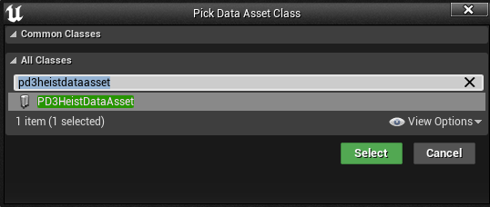

# Data Assets

To create a data asset, follow these simple instructions:
1. Right-click on the content browser and select `Miscellaneous` and choose `Data Asset` 
2. Search for the data asset type you want to use, for this example I use `PD3HeistDataAsset`, and select it. And finally, name it. 
