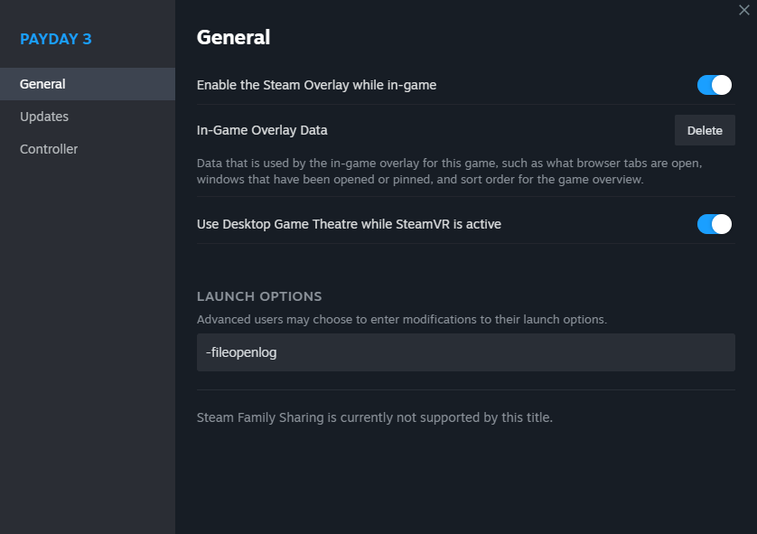

# Unreal Editor

:::note
As of writing, PAYDAY 3 uses Unreal Engine 4.27.
If PAYDAY 3 upgrades to Unreal Engine 5, this documentation will become obsolete until updated.
:::

## Intro
To begin using the Unreal Editor, you must ensure you have version 4.27 installed.
You can either compile it yourself from source or you can install it through the Epic Games Launcher.

:::note
If you do not wish to use the PAYDAY3 modkit, you must make sure your project is called `PAYDAY3`.

Not using the PAYDAY3 modkit is unsupported and not recommended as you do not have access to PAYDAY3's data formats.
:::

## Testing your mod

### Setting up PAYDAY 3 to allow your PAK to be loaded
As of writing, PAYDAY 3 will check if your PAK file has a generated signature,
this can be bypassed by passing `-fileopenlog` to PAYDAY 3 when it launches.

You can set this easily by putting the launch option in the steam launch options


### Cooking
PAYDAY 3 requires all of its files to be cooked,
so you must cook your game files everytime you want to package and test your mod.

You can cook your game files by opening the `File` menu and clicking `Cook Content for Windows`.
Once cooked, your files will be located at `{UE4ProjectDir}/Saved/Cooked/WindowsNoEditor/`.


### Packaging
When packaging your game files, you must be incredibly careful not to package any dummy assets used by the modkit.
If you package any dummy assets, the game could crash or create other obscure issues.
In order to package your game files, you must make sure you have [cooked](#cooking) your files first.

Once cooked, you must copy out all the files your mod replaces or adds, like maps, models, textures, etc.
When copying you must make sure the folder structure stays the same.
For example, a custom map at `{UE4ProjectDir}/Saved/Cooked/WindowsNoEditor/PAYDAY3/Maps/CoolMap/CoolMap.umap`
should be copied to `{PackagingStagingFolder}/PAYDAY3/Maps/CoolMap/CoolMap.umap`.

Once all your files are copied, you must now package the `PackageStagingFolder` with the tool of your choice.
The tool you use is up to personal preference, but the recommended tool is [repak by trumank](https://github.com/trumank/repak)

1. Add [repak](https://github.com/trumank/repak/releases/latest) to your [`PATH`](https://medium.com/@kevinmarkvi/how-to-add-executables-to-your-path-in-windows-5ffa4ce61a53) or drop the exe next to the folder you want to pak (`PackageStagingFolder` in this case)
2. Open a `cmd` or `powershell` window in the folder by holding the `Shift` key and right clicking on the explorer background, then select in the context menu select "Open [command or powershell] window here".
3. Run `repak.exe pack PackageStagingFolder` to pack `PackageStagingFolder` into `PackageStagingFolder.pak`.
```
C:\PD3_Modding> repak.exe pack PackagingStagingFolder
Packed 2 files to PackagingStagingFolder.pak
```
4. To verify proper packaging, you can run `repak.exe list PackageStagingFolder.pak` and it will list all the paths e.g.:
```
C:\PD3_Modding> repak.exe list PackageStagingFolder.pak
PAYDAY3/Maps/CoolMap/CoolMap.umap
PAYDAY3/Maps/CoolMap/CoolMap.uexp
```

Once packaged, place your pak files in `{InstallFolder}/PAYDAY3/Content/Paks/~mods/` (create ~mods if it does not exist) and your mod should be loaded by PAYDAY 3.

:::info Packaging for use with the launcher
It's highly recommended to create a `pd3mod` before you upload your mod for users to install.
See the documentation on [Packaging](../packaging) for more info.
:::

## Load Order
Unreal Engine loads files in PAKs in alphabetical order, so if you want your mod to load after another mod,
you must make sure your mod's name comes after the other mod's name alphabetically.
It is best to prefix your mod's name with the letter `z`, ensuring it will load last and overwrite any file you need it to.

## Viewing PAYDAY 3's PAK files
In order to view PAYDAY 3's PAK files, you must first obtain the AES key.
While we cannot distribute the AES key ourselves, you can dump it very easily.
Once the AES key is obtained, you can open PAYDAY 3's files in the program of your choice such as [FModel](https://github.com/4sval/FModel/releases).
