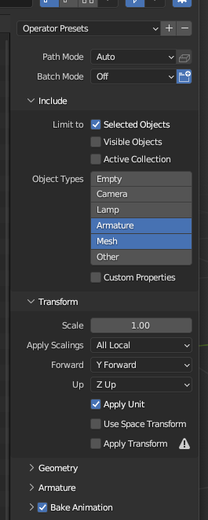
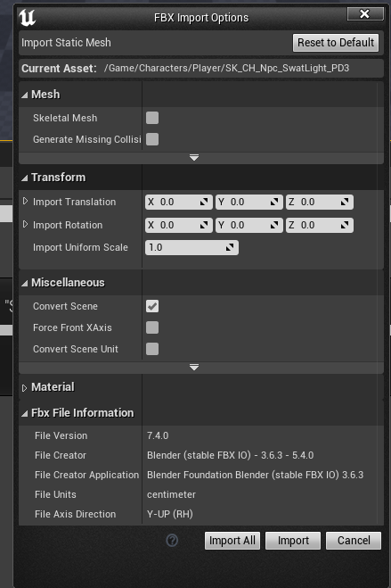
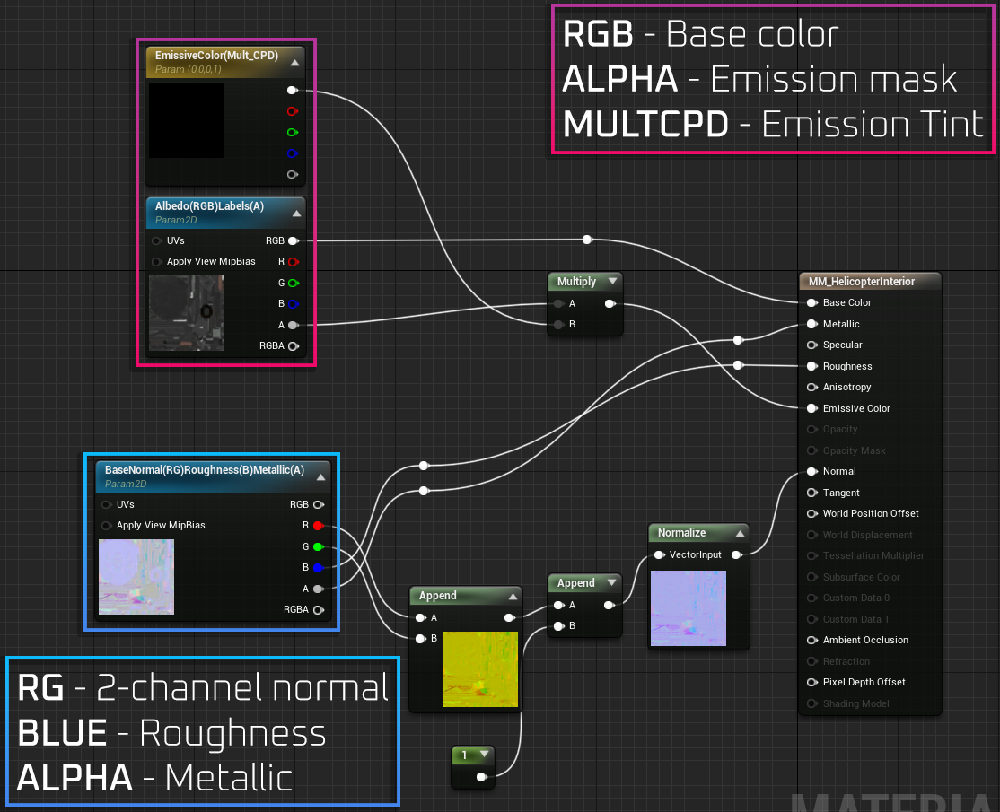

# Static Model Replacements

## Prerequisites

 ** Unreal Engine 4.27.2 is required
 ** A program that can extract assets from UE4 PAK files (FModel, UModel)
 ** A program that can pack UE4 files (repak, UnrealPak)
 ** Model editing program, such as Blender, Maya, 3ds Max... (needs to support .psk files)
 ** Blender plugin for importing .psk files (https://github.com/matyalatte/blender3d_import_psk_psa)
 ** Basic knowledge of PBR materials and texture packing

## Extracing models from game files - Introduction

For this, we will be using Fmodel, you can also use Umodel, however Fmodel is the easiest to work with and has better support. I will also be using Blender with the .psk addon.
It's exptected you have an idea how to use Blender and know basics of rigging.

### Using Blender

1. Import the .psk file you exported using [Fmodel.](/docs/modding-basics/using-fmodel)
2. Rig the models accordingly if necessary, some models don't have a skeleton or vertex groups.
3. Add 3 addtional empty UV maps. (scale down until they're not visible). This is necessary to remove possible masking being applied to the model.
4. Add an additional empty material assigned to a face, has to be first slot. This is necessary to remove possible masking being applied to the model, however not the case with all models. It's a good habit to include it.
5. Export the model as .FBX with following settings:

### Importing in Unreal Engine

1. You will need to set up the correct project hierchary, using the Moneybags as example, the hierarchy is as follows: 
`Content/Gameplay/Player/Props/Moneybag_01`
2. Import the .FBX with these settings if you're importing a static mesh:

### Creating materials

1. We will be referencing already existing master material in the game.
2. Create project hierarchy:
`Content/MasterMaterial/Vehicles/Helicopter`
3. Create a Material, name it as following `MM_HelicopterInterior`
4. Set up the material as following:

5. Import your textures wherever you wish, they will need to have a specific packing in order to work.

### Packing textures

1. You can use either Substance Painter with an export preset or any image manipulation program.
2. Your texture should be packed as following:

** Albedo(RGB)Labels(A)
    RGB: - base color/albedo 
    Alpha: - emission mask
** BaseNormal(RG)Roughness(B)Metallic(A)
    RG: - 2-channel DirectX normal map
    Blue: - Roughness
    Alpha: - Metallic

3. Set the Normal texture Compression Settings to Masks.

### Creating and assigning material instances

1. Create a material instance from the MM_HelicopterInterior material, put it wherever you wish.
2. Open up your model and assign material instances accordingly.

### Cooking and packing

There's a few ways to do this, I will cover the way I personally cook and pack my mods. You can also generate chunks and selectively choose what to pack. 

1. In Unreal Engine, go into File -> Cook Content for Windows. This will cook the content in `YourProjectName\Saved\Cooked`
2. Go in `YouProjectName\Saved\Cooked\WindowsNoEditor\YouProjectName` and copy the Content folder.
3. Paste the Content folder in a different location where your workfolder is located. (You should create some sort of a workfolder for organization, not necessary)
4. Create a folder called pakchunk99-Mods_YourModsName_P and paste in the Content folder you copied. (Mod names can differ, this is just how I personally name them, the `_P` is necessary)
5. Find the master material uasset (MM_HelicopterInterior.uasset) and don't cook/don't copy it to your mods workfolder.
6. Create the .pak file, you can either use [UnrealPak, repak or other solutions.](/docs/additional-resources/tools)

### Testing the mod

1. Put the .pak file in the game's Paks directory `PAYDAY3\PAYDAY3\Content\Paks` or the `mods folder`.
2. The model should now appear in-game if you've done everything correctly.

# Skeletal Model Replacements

:::caution Work in progress
This section is not yet available.
:::
