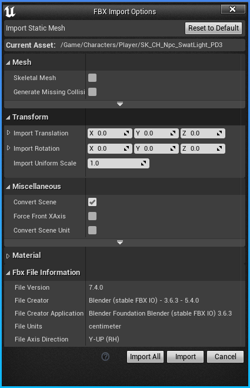
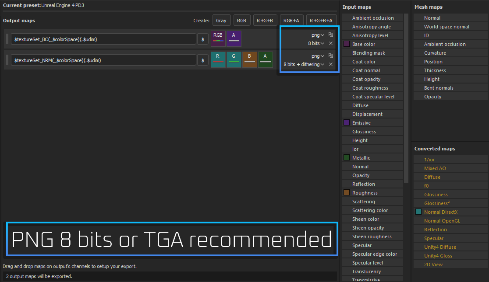
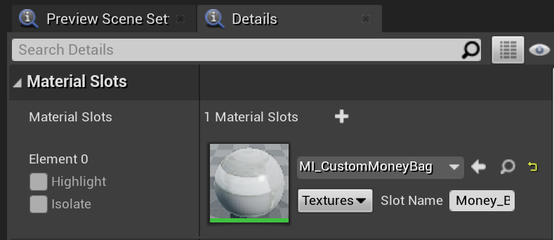

# Static Model Replacements
This guide will explain how to replace a static mesh with your own.

For this guide, we will be using FModel and Blender.
If you're adventurous, it's possible to use other tools such as UModel and 3ds Max.
You are expected to have an idea of how to use Blender and know the basics of rigging.

:::caution Skeletal meshes
A guide on replacing skeletal meshes is not yet available.
:::

## Prerequisites
- An installation of the [Unreal Editor](/docs/getting-started/dependencies#unreal-editor) (same version as the game)
- Basic knowledge of Pak modding.
  See the pages on modding using the [Unreal Editor](/docs/getting-started/unreal-editor)
  and [Texture Replacements](/docs/modding-basics/texture-replacement).
- A model exported from the game as `.psk` format using [FModel](/docs/modding-basics/using-fmodel) or UModel.
- Blender with the [blender3d_import_psk_psa](https://github.com/matyalatte/blender3d_import_psk_psa) plugin installed.
  Or another model editing program with support for the ActorX format (psk/pskx/psa).
- Basic knowledge of PBR materials and texture packing

## Creating your mesh
1. Import the `.psk` file you exported using [FModel](/docs/modding-basics/using-fmodel) into Blender.
2. Rig the models accordingly if necessary, some models don't have a skeleton or vertex groups.
3. Add three additional "empty" UV maps.
   To do this, scale them down until they're not visible.
   This is sometimes necessary to remove masking being applied to the model.
   You can easily scale them down to invisible by selecting the entire UV,
   then inputting S (for scale) then 0 (for size 0). Then hit enter.
5. Add an empty material assigned to a face, and make it the first slot.
   This is sometimes necessary to remove masking being applied to the model.
   It is not the case with all models, however, it's a good habit to include it.
6. Export the model as `.fbx` with the following settings:

## Importing in Unreal Engine
1. You will need to set up the correct project hierarchy, using the money bag model as an example,
   the hierarchy is as follows: `Content/Gameplay/Player/Props/Moneybag_01/Meshes`
2. Always remember that unreal projects make the Content folder for you. So start your
   path recreation from Content/
3. Import the .FBX with these settings if you're importing a static mesh:

## Stubbing a master material
Due to an unresolved issue, it is not yet possible to create fully custom materials.
With a bit of work, we can still do most things
by creating a new **material instance** from one of the game's built in **master materials**.

For this guide, we will be using the `MM_HelicopterInterior` master material.
Don't worry about the name of this material, it should be fit for most purposes.
To stub the material from the game,
create a new Material in your editor called `MM_HelicopterInterior` under `Content/MasterMaterial/Vehicles/Helicopter`.

Next, we'll have to edit the material to add some parameters we want to use in our material instance.
If you want the editor preview of the mesh to look approximately like it will in-game, you can replicate the setup below.
If you don't mind what it looks like in the editor, you can simply add the parameters and hook them up to any material output.

:::tip
You can find many more master materials and their available parameters
in the [asset-gen branch](https://github.com/MoolahModding/MoolahProject/tree/asset-gen) of the modkit.
This project has all the master materials from the game pre-generated for you,
but keep in mind that the parameters are not hooked up correctly to the output node.
:::

## Packing textures
Import your textures somewhere under `/Content/Mods/[YourModName]`,
they will need to have a specific packing in order to work.
The textures for the `MM_HelictopterInterior` material we used earlier are packed as follows:
- **Texture 1** - `Albedo(RGB)Labels(A)`
  - RGB: base color/albedo 
  - Alpha: emission mask
- **Texture 2** - `BaseNormal(RG)Roughness(B)Metallic(A)`
  - RG: 2-channel DirectX normal map
  - Blue: roughness
  - Alpha: metallic

In order to achieve this,
you can use either [Substance Painter](https://www.adobe.com/be_en/products/substance3d-painter.html) with an export preset
or any image manipulation program.

Substance Painter preset for HelicopterInterior texture packing:

After importing into the editor,
set the **Compression Settings** of the normal texture to **Masks** or **BC7 with sRGB unticked**.
BC7 results in higher quality but also a bigger file size.

## Creating and assigning material instances
Create a material instance from the MM_HelicopterInterior material,
and place it somewhere under `/Content/Mods/[YourModName]`.
Open your newly created material instance and assign the two texture parameters.

Finally, you can open up your model and assign the material instance(s) accordingly.

## Cooking and packing
To learn how to package this correctly,
see the [cooking and packaging sections of the Unreal Engine guide](/docs/getting-started/unreal-editor/#cooking). 
You will need to include:
- The mesh you're replacing, for example `PAYDAY3/Content/Gameplay/Player/Props/Moneybag_01/Meshes/MoneyBag_01_PD3.uasset`
- Everything under `PAYDAY3/Content/Mods/[YourModName]`, this should have your material instances and textures

:::danger
Do **not** include the master material stub (`MM_HelicopterInterior` if you followed the guide exactly).
It is only intended to give your material instance the correct reference to the in-game asset.
:::

## Testing the mod
Put your .pak file in the game's Paks directory under `PAYDAY3/PAYDAY3/Content/Paks/~mods`.
The model should now appear in-game if you've done everything correctly.
