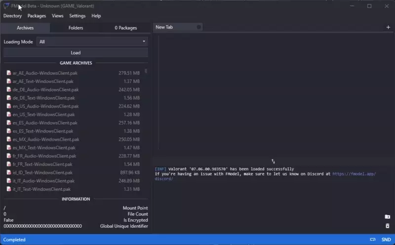
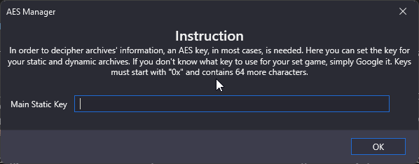

# Using FModel

## Set up FModel for PAYDAY 3
Open up FModel and set it up for PAYDAY 3 by clicking `Directory` > `Selector`.
Then add the name of the game (doesn't matter what you call it) and the **root** directory of the game.

As of writing, PAYDAY 3 uses an AES key so in order to access the game files, you need to give the AES key to FModel.
Open the menu for that by clicking `Directory` > `AES`.

That's it! You should now be able to access the game files without repeating this step.

## Exporting

Next, click on `Load` under the `Archives` tab, making sure Loading Mode is set as `All`.

You should now see two folders, navigate through the PAYDAY3 folder and find which texture you wish to replace.
You can also press <kbd>CTRL</kbd> + <kbd>SHIFT</kbd> + <kbd>F</kbd> to search for assets.
We'll export the phone screen texture (`PAYDAY3/Content/Environment/_Common/Interactable/MobilePhone_01/Component/T_PhoneScreenWithAlpha_`) 

Once you find the texture you wish to replace, right click on the file and click `Save Texture (.png)`.
FModel should print out a message on the console with a path you can click to open the directory the file was saved to.

The process is very similar for other assets. For models you want to export to `psk`, animations `psa`.
In some cases you will need to export to raw data.